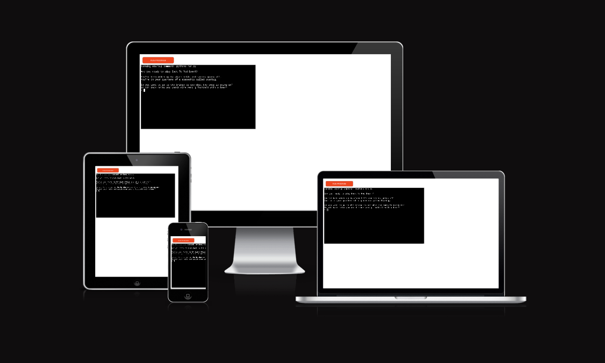
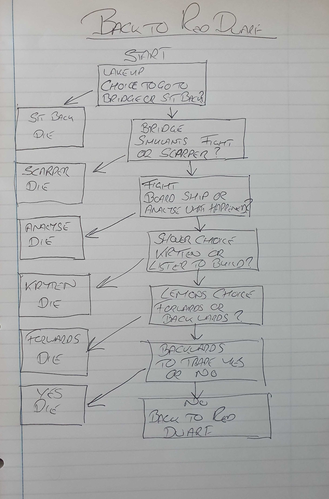
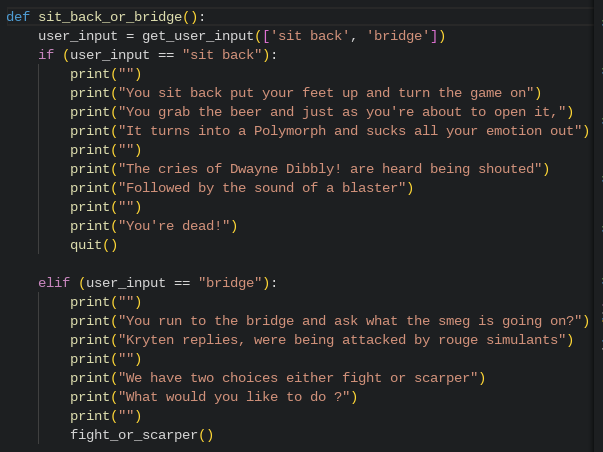
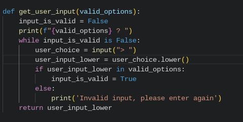
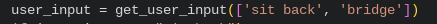
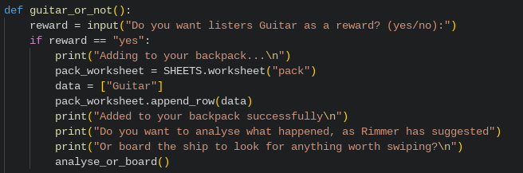
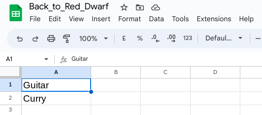
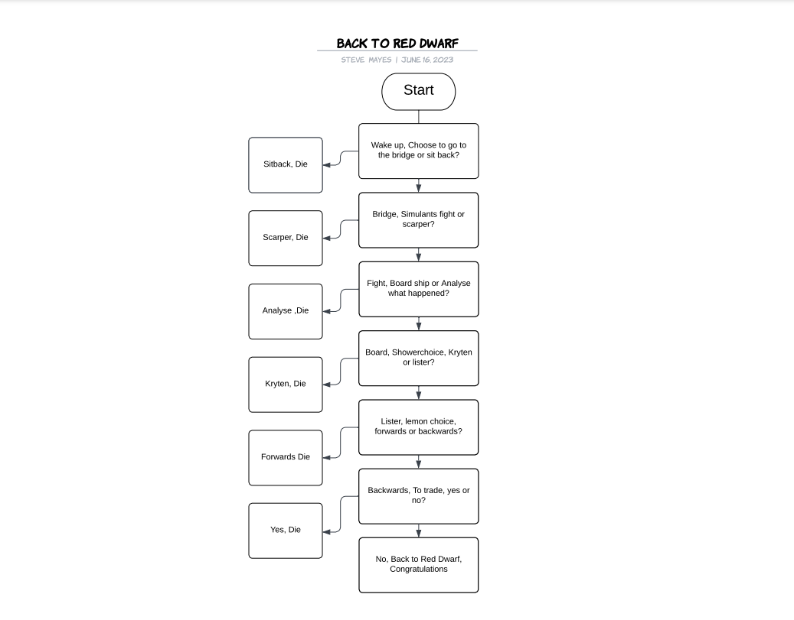

# Back to Red Dwarf


Welcome to Back to Red Dwarf. The texted based adventure game. I created the game because I have fond memories of playing similar games in my youth. I used to get lost in the worlds that had been created. So it was great fun to be able to make my own. I decided on Back to Red Dwarf due to being a big fan of the show. Plus I enjoy humour in my adventure games. So it seemed only fitting that I marry the Red Dwarf story to the text-based adventure game. Back to Red Dwarf has been designed so anyone can enjoy this simple but enjoyable game, so they to can enjoy moments as I did as a child.



https://ui.dev/amiresponsive?url=https://red-dwarf.herokuapp.com


## Design Process (UX)
When I started the design of Back to Red Dwarf I wanted to ensure the site was Useful, Useable and Valuable so that it makes the user experience immersive and enjoyable for the user. To do this I looked at the five key fundamentals;


Strategy - So the user can enjoy this simple, enjoyable, texted based game while immersing themselves in a fictional scenario.


Scope - Based on the information from the strategy. The features included control of their journey by selecting to go one way or the other. A lowercase converter was added to ensure that if the user did put uppercase in the input field it would not affect the game. However, I have also added code to help show the user the correct text required, if they did put any other word in the input field it will display an invalid message. I have also placed rewards in the game so that the user can pick up items or leave them behind as rewards for getting the right choices. This has been linked to google sheets so that the items collected can be displayed as though they have been put in their backpack.


Structure - This was designed to lead the user on a journey through a few of my favourite episodes of Red Dwarf. The key part was that they were in control of their journey by selecting to go one way or the other. A lowercase converter was added to ensure that if the user did put uppercase in the input field it would not affect the game. However, I have also added code to help show the user the correct text required if they did put any other word in the input field, as well as the rewards for completing sections of the game as mentioned previously.


Skeleton - As before this was designed to lead the user on a journey through a few of my favourite episodes of Red Dwarf. The user has been given a number of different scenarios so they can have a fun and challenging experience. Due to it being a back-end application, it dictated that it would be one page, laid out simply. So that it can be used quickly and efficiently while delivering the most amount of fun.


Surface - I wanted the look of Back to Red Dwarf to be informative, clear, and concise, with consistency throughout. However, due to it being a back-end application and the time scales involved I was limited to the text supplied by codeanywhere and heroku


Then I sat down and roughly sketched out onto paper what the journey would look like. This then gave me the basis to start creating Back to Red Dwarf in Codeanywhere.





## Features


Back to Red Dwarf has been designed so the user feels in control of their journey by selecting to go one way or the other. A lowercase converter was added to ensure that if the user did put uppercase in the input field it would not affect the game. However I have also added code to help show the user the correct text required if they did put any other word in the input field, plus it will display an invalid message. I have also added a reward for completing sections of the game which is connected to google sheets.


### Existing Features


- **Choice of direction**


- Having the choice of direction is key to the text based computer game so the user feels in control of their journey by giving them several options to choose from.





- **One loop for all inputs to check for validity & Lowercase converter**


- A lowercase converter was added to ensure that if the user did put uppercase in the input field it would not affect the game play and ruin the user experience. Plus a invalid message was also attached should they enter a wrong word.





- **Clear word choice #3**


- I have also added code to help show the user the correct text required if they did put any other word in the input field as could very easily happen.





- **Reward logged into inventory**


- I have included a number of rewards so the user has the satisfaction of getting something while completing the game,I have linked them to google sheets so the items that they choose to pick up are stored so that they can check to see what they have.







### Future Features


- Adding four times the current amount of rooms #1
- The game would definitely benefit from having a longer, more immersive experience. So to add four times the amount of rooms would make the game so much more challenging
- Pictures added #2
- I'd like to add pictures to the game. Something like your dead and a picture depicting the particular death you suffered or pictures to celebrate a decision well made or even finishing the game.


## Tools & Technologies Used


- [Python](https://www.python.org) used as the back-end programming language.
- [Git](https://git-scm.com) used for version control. (`git add`, `git commit`, `git push`)
- [GitHub](https://github.com) used for secure online code storage.
- [GitHub Pages](https://pages.github.com) used for hosting the deployed front-end site.
- [codeanywhere](https://app.codeanywhere.com/) used as a cloud-based IDE for development.
- [Heroku](https://www.heroku.com) used for hosting the deployed back-end site.
- [Lucidchart](https://www.lucidchart.com) used for the flowchart.


## Data Model


### Flowchart


To follow best practice, a flowchart was created for the app's logic,
and mapped out before coding began using a free version of
[Lucidchart](https://www.lucidchart.com/pages/ER-diagram-symbols-and-meaning).


Below is the flowchart of the main process of this Python program. It shows the entire cycle of the program.





### Classes & Functions


The program uses classes as a blueprint for the project's objects (OOP). This allows for the object to be reusable.


```python
def get_user_input(valid_options):
input_is_valid = False
print(f"{valid_options} ? ")
while input_is_valid is False:
user_choice = input("> ")
user_input_lower = user_choice.lower()
if user_input_lower in valid_options:
input_is_valid = True
else:
print('Invalid input, please enter again')
return user_input_lower


def sit_back_or_bridge():
user_input = get_user_input(['sit back', 'bridge'])
if (user_input == "sit back"):
print("")


def guitar_or_not():
reward = input("Do you want listers Guitar as a reward? (yes/no):")
if reward == "yes":
print("Adding to your backpack...\n")
pack_worksheet = SHEETS.worksheet("pack")
data = ["Guitar"]
pack_worksheet.append_row(data)
print("Added to your backpack successfully\n")
```


The primary functions used on this application are:


- `user_input = get_user_input(['sit back', 'bridge'])`
- To allow the user to input commands.
- `input_is_valid = False`
- Keeps track of the input validity
- `valid_options`
- Used to wait for the user to put in a valid option
- `user_input_lower`
- To ensure case insensitive
- `if`
- If statement is used for conditional execution or branching..
- `userChoice == ""`
- It checks the variable is equal to the string literal.
- `elif`
- Used with if in case the if condition is not met. else if.
- `else`
- Also used with if and elif when their condition are not met
- `print`
- To display text in the console
- `def`
- Keyword to define a function
- `pack_worksheet = SHEETS.worksheet("pack")`
- enables the variable to be connected to a specific worksheet
- `data = ["Guitar"]`
- To display the string "guitar" to the variable data
- `pack_worksheet.append_row(data)`
- To add a new row of data to a specific worksheet


## Testing


For all testing, please refer to the [TESTING.md](TESTING.md) file.


## Deployment


Code Institute has provided a [template](https://github.com/Code-Institute-Org/python-essentials-template) to display the terminal view of this backend application in a modern web browser.
This is to improve the accessibility of the project to others.


The live deployed application can be found deployed on [Heroku](https://red-dwarf.herokuapp.com).


### Heroku Deployment


This project uses [Heroku](https://www.heroku.com), a platform as a service (PaaS) that enables developers to build, run, and operate applications entirely in the cloud.


Deployment steps are as follows, after account setup:


- Select **New** in the top-right corner of your Heroku Dashboard, and select **Create new app** from the dropdown menu.
- Your app name must be unique, and then choose a region closest to you (EU or USA), and finally, select **Create App**.
- From the new app **Settings**, click **Reveal Config Vars**, and set the value of KEY to `PORT`, and the value to `8000` then select *add*.
- If using any confidential credentials, such as CREDS.JSON, then these should be pasted in the Config Variables as well.
- Further down, to support dependencies, select **Add Buildpack**.
- The order of the buildpacks is important, select `Python` first, then `Node.js` second. (if they are not in this order, you can drag them to rearrange them)


Heroku needs two additional files in order to deploy properly.
- requirements.txt
- Procfile


You can install this project's **requirements** (where applicable) using:
- `pip3 install -r requirements.txt`


If you have your own packages that have been installed, then the requirements file needs updated using:
- `pip3 freeze --local > requirements.txt`


The **Procfile** can be created with the following command:
- `echo web: node index.js > Procfile`


For Heroku deployment, follow these steps to connect your own GitHub repository to the newly created app:


Either:
- Select **Automatic Deployment** from the Heroku app.


Or:
- In the Terminal/CLI, connect to Heroku using this command: `heroku login -i`
- Set the remote for Heroku: `heroku git:remote -a app_name` (replace *app_name* with your app name)
- After performing the standard Git `add`, `commit`, and `push` to GitHub, you can now type:
- `git push heroku main`


The frontend terminal should now be connected and deployed to Heroku!


### Local Deployment


This project can be cloned or forked in order to make a local copy on your own system.


For either method, you will need to install any applicable packages found within the *requirements.txt* file.
- `pip3 install -r requirements.txt`.


If using any confidential credentials, such as `CREDS.json` or `env.py` data, these will need to be manually added to your own newly created project as well.


#### Cloning


You can clone the repository by following these steps:


1. Go to the [GitHub repository](https://github.com/Pimmz/Project-3)
2. Locate the Code button above the list of files and click it
3. Select if you prefer to clone using HTTPS, SSH, or GitHub CLI and click the copy button to copy the URL to your clipboard
4. Open Git Bash or Terminal
5. Change the current working directory to the one where you want the cloned directory
6. In your IDE Terminal, type the following command to clone my repository:
- `git clone https://github.com/Pimmz/Project-3.git`
7. Press Enter to create your local clone.


Alternatively, if using Gitpod, you can click below to create your own workspace using this repository.


[](https://gitpod.io/#https://github.com/Pimmz/Project-3)


Please note that in order to directly open the project in Gitpod, you need to have the browser extension installed.
A tutorial on how to do that can be found [here](https://www.gitpod.io/docs/configure/user-settings/browser-extension).


#### Forking


By forking the GitHub Repository, we make a copy of the original repository on our GitHub account to view and/or make changes without affecting the original owner's repository.
You can fork this repository by using the following steps:


1. Log in to GitHub and locate the [GitHub Repository](https://github.com/Pimmz/Project-3)
2. At the top of the Repository (not top of page) just above the "Settings" Button on the menu, locate the "Fork" Button.
3. Once clicked, you should now have a copy of the original repository in your own GitHub account!


### Local VS Deployment


There are no differences between the local version Ive developed, and the live deployment site on Heroku.


## Credits


- [python](https://www.w3schools.com/python/default.asp) used to assist with python throughout the site.
- [Git](https://git-scm.com) used for version control. (`git add`, `git commit`, `git push`)
- [heroku](https://devcenter.heroku.com/start) used to assist with heroku.
- Tutor support at code institute
- Antonio Rodriguez Mentor at code institute
- Love Sandwiches project at code institute


### Content


| Source | Location | Notes |
| --- | --- | --- |
| [Markdown Builder](https://traveltimn.github.io/markdown-builder) | README and TESTING | tool to help generate the Markdown files |
| [Chris Beams](https://chris.beams.io/posts/git-commit) | version control | "How to Write a Git Commit Message" |
| [W3Schools](https://www.w3schools.com/python/default.asp) | entire site | functions |
| [W3Schools](https://www.w3schools.com/python/python_conditions.asp) | entire site | if, elif and else |
| [W3Schools](https://www.w3schools.com/python/python_while_loops.asp) | intial function | while loop |
| [W3Schools](https://www.w3schools.com/python/python_user_input.asp) | entire site | Python user input |
| [W3Schools](https://www.w3schools.com/python/ref_list_append.asp) | entire site | Python list append method |
| [YouTube](https://youtu.be/ORsJn-71__0) | Basic structure | How to code a basic adventure game |


### Acknowledgements


- I would like to thank my Code Institute mentor, [Antonio Rodriguez] for their support throughout the development of this project.
- I would like to thank the [Code Institute](https://codeinstitute.net) tutor team for their assistance with troubleshooting and debugging some project issues.
- I would like to thank the [Code Institute Slack community](https://code-institute-room.slack.com) for the moral support; it kept me going during periods of self-doubt and imposter syndrome.
- I would like to thank my partner (Hilda), for believing in me, and allowing me to make this transition into software development.


