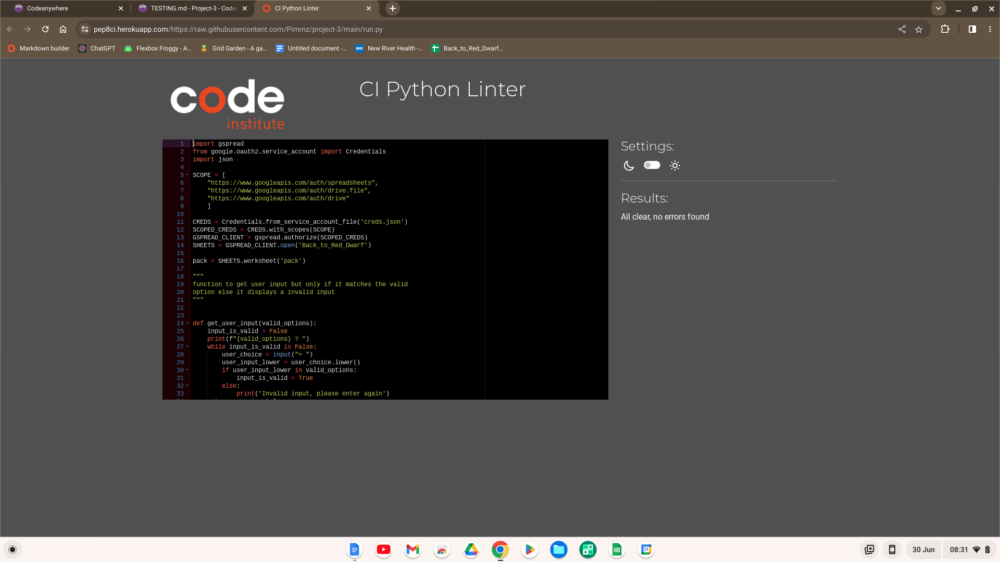
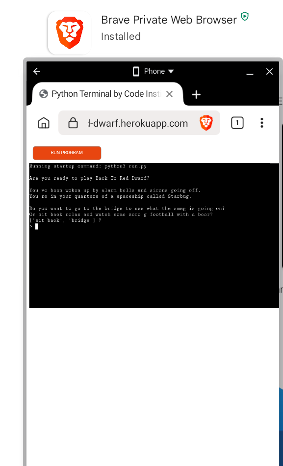

# Testing

Return back to the [README.md](README.md) file.

To ensure that Back to Red Dwarf works effectively over a number of sites and devices, I have prepared details and screenshots for you to see the testing I have done to ensure it is very reliable..

## Code Validation

### Python

I have used the recommended [PEP8 CI Python Linter](https://pep8ci.herokuapp.com/) to validate all of my Python files.

| File | CI URL | Screenshot | Notes |
| --- | --- | --- | --- |
| run.py | [PEP8 CI](https://pep8ci.herokuapp.com/https://raw.githubusercontent.com/Pimmz/project-3/main/run.py) |  | No errors |

## Browser Compatibility

I have tested Famous Quote Matcher on four different browsers. The first was Chrome, the second was Firefox, the third was Brave and the fourth was Opera. I would have liked to test on Safari but unfortunately, I don’t have access to an Apple device.

- [Chrome](https://www.google.com/chrome)
- [Firefox (Developer Edition)](https://www.mozilla.org/firefox/developer)
- [Brave](https://brave.com/download)
- [Opera](https://www.opera.com/download)

I've tested my deployed project on multiple browsers to check for compatibility issues. To ensure that all are working correctly I have also tested for responsiveness on desktop, tablet and mobile.

| Browser | Screenshot | Notes |
| --- | --- | --- |
| Chrome Desktop|  | Works as expected |
| Chrome Tablet |  | Works as expected |
| Chrome Mobile|  | Works as expected |
| Firefox Desktop|  | Works as expected |
| Firefox Tablet|  | Works as expected |
| Firefox Mobile|  | Works as expected |
| Brave Desktop|  | Works as expected |
| Brave Tablet|  | Works as expected |
| Brave Mobile|  | Works as expected |
| Opera Desktop|  | Works as expected |
| Opera Tablet|  | Works as expected |
| Opera Mobile|  | Works as expected |
| x | x | repeat for any other tested browsers |

## Responsiveness

I've tested my deployed project on multiple devices to check for responsiveness issues.

| Device | Screenshot | Notes |
| --- | --- | --- |
| Iphone se |  | Works as expected |
| Ipad mini |  | Works as expected |
| Pixel 5|  | Works as expected |
| S20 Ultra |  | Works as expected |
| Surface Pro |  | Works as expected |
| Galaxy fold |  | Works as expected |
| Nest |  | Works as expected |

## Lighthouse Audit

I've tested my deployed project using the Lighthouse Audit tool to check for any major issues.

| Page | Size | Screenshot | Notes |
| --- | --- | --- | --- |
| Home | Mobile |  | Some performance warnings |
| Home | Desktop |  | Low SEO due to meta description|

## Bugs

When completing the project I only came across the following the error message:

- Python `E501 line too long` (98 > 79 characters)

    

    - To fix this, I reduced down the length of the line by rewording the sentence so that it was under 79 characters.
    - I also used the print("") if the next line character(\n) was pushing the line length just over the allowed characters. 

- Traceback (most recent call last): File "/app/run.py", line 1, in <module>
  import gspread ModuleNotFoundError: No module named 'gspread'

    

    - This was caused due to an updated worksheet in codeanywhere as I had run out of hours. The gspread module had been deleted so I had to reinstall "pip install gspread" to correct the issue.

**Open Issues**

There are no open issues that I am aware of. Issues can be tracked [here](https://github.com/Pimmz/Project-3/issues).

## Unfixed Bugs

There are no remaining bugs that I am aware of.